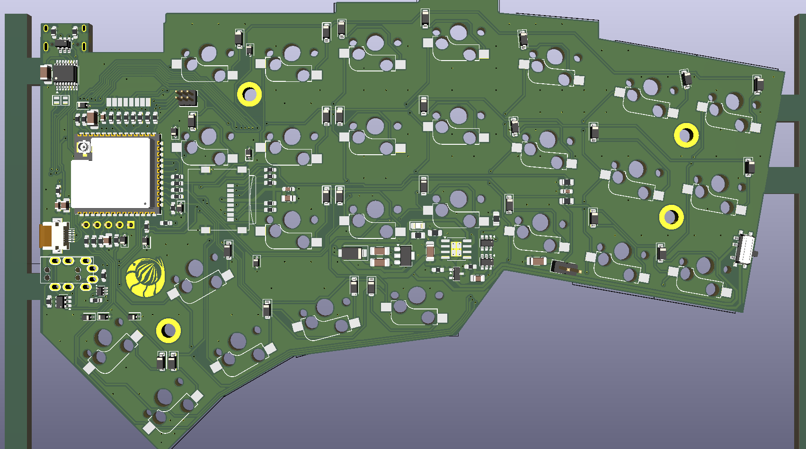

<p align="center">
  <picture>
    <source media="(prefers-color-scheme: dark)" srcset="images/niphargus_logo_white.svg">
    
  </picture>
</p>

<h1 align="center">Niphargus</h1>

<p align="center">
  <em>The cave shrimp: blind, discreet, indestructible.</em><br>
  <em>La crevette des cavernes : aveugle, discrète, indestructible.</em>
</p>



---

## English

Niphargus is a thin, unkillable wireless split keyboard.

- **Two self-contained halves** — one ESP32-S3-WROOM-1 + nRF24L01+ and a 16340
  cell each, matrix scanning in deep sleep (RTC domain), KaSe dongle on the host side.
- **Wired fallback** — direct USB-C plus a TRRS jack between halves: *plugging it
  back in must be enough*. A 5 V handshake on the link makes hot-plug spark-free.
- **ESD hardening throughout** — TVS diodes on USB and TRRS, 100 Ω in series on
  every matrix line, careful ground planes. The static discharge you bring back
  to the keyboard will no longer crash it.
- **Sharp Memory LCD** (right half) for layer and battery status: holds its image
  at a few µA and never flickers. **Azoteq TPS43 trackpad** (left half), over I²C.
- **The survival kit** — an ESP32-P4 vault behind a CH334R USB hub: multi-ISO boot
  key, PGP token, storage. It only powers up when the keyboard is plugged in.

A complete redesign of the **Rouge-Gorge** (v1, 2022), a Jorne / Kyria rev2
derivative that was never built. This repository carries the full history:
Rouge-Gorge → rili → Niphargus.

**Status (2026-08)** — v2 schematic complete and reviewed, board routed, ERC and
DRC clean. Case in progress (see below). Firmware to follow.

## Français

Niphargus est un clavier split sans fil, fin et increvable.

- **Deux moitiés autonomes** — ESP32-S3-WROOM-1 + nRF24L01+ et une batterie 16340
  chacune, scan de la matrice en sommeil profond (domaine RTC), dongle KaSe côté hôte.
- **Repli filaire** — USB-C direct et jack TRRS entre les moitiés : *rebrancher
  doit suffire*. Une poignée de main 5 V sur le lien évite les étincelles au branchement à chaud.
- **Robustesse ESD partout** — TVS sur USB et TRRS, 100 Ω série sur chaque ligne
  de matrice, plans de masse soignés. La décharge que vous ramenez au clavier ne
  le plantera plus.
- **Écran Sharp Memory LCD** (moitié droite) pour le calque et l'état des batteries :
  tient l'image à quelques µA sans jamais clignoter. **Trackpad Azoteq TPS43**
  (moitié gauche), en I²C.
- **La trousse de secours** — un coffre ESP32-P4 derrière un hub USB CH334R : clé
  bootable multi-ISO, token PGP, stockage. Il ne s'allume qu'en filaire.

Refonte complète du **Rouge-Gorge** (v1, 2022), un dérivé du Jorne et du Kyria
rev2 resté sur le papier. Le dépôt porte tout l'historique :
Rouge-Gorge → rili → Niphargus.

**État (2026-08)** — schéma v2 terminé et relu, carte routée, ERC et DRC au vert.
Boîtier en cours (ci-dessous). Firmware à suivre.

---

## Repository layout · Organisation du dépôt

| Path | Contents |
|---|---|
| `hardware/pcb/` | KiCad project — `niphar.kicad_pro` (schematic, board, footprints) |
| `hardware/order-*.csv` | Part orders: TME, LCSC, AliExpress |
| `hardware/kit-jlcpcb/` | Gerbers, BOM and CPL for JLCPCB |
| `case/` | Case generator and CAD output |
| `scripts/` | Anti-regression checks |
| `docs/` | Design specs and plans |

### Case · Boîtier

Three parts: a **CNC-machined 8.5 mm aluminium frame**, sandwiched between two
**2 mm polycarbonate plates**, 12.5 mm overall. The 16340 cell sits *beside* the
board, in a pocket milled into the frame itself.

Trois pièces : un **cadre aluminium usiné de 8,5 mm** pris entre deux **plaques
polycarbonate de 2 mm**, 12,5 mm hors tout. La 16340 se loge *à côté* de la carte,
dans une poche fraisée à même le cadre.

The frame outline is **not computed — it is drawn**. Edit `case/case_outline.svg`
(KiCad coordinates, 1 unit = 1 mm), then run:

Le contour du cadre n'est **pas calculé, il est dessiné**. Éditez
`case/case_outline.svg` (repère KiCad, 1 unité = 1 mm), puis lancez :

```sh
freecad --console case/gen_case.py
```

This regenerates the `.FCStd`, the STEP, the STL files and `case_plan.svg`.

### Anti-regression · Anti-régression

```sh
./scripts/check.sh --fast   # schematic ERC against the committed baseline
./scripts/check.sh          # + full board DRC
./scripts/install-hooks.sh  # once per clone: pre-push runs the full check
```

Green means *never more ERC/DRC errors or warnings than the committed baseline*
(`.tripwire-kicad-baseline`). CI is pinned to KiCad 10.0.4 with its own reference.

Vert signifie *jamais plus d'erreurs ni de warnings ERC/DRC que la référence
committée*. La CI est épinglée sur KiCad 10.0.4 avec sa propre référence.
